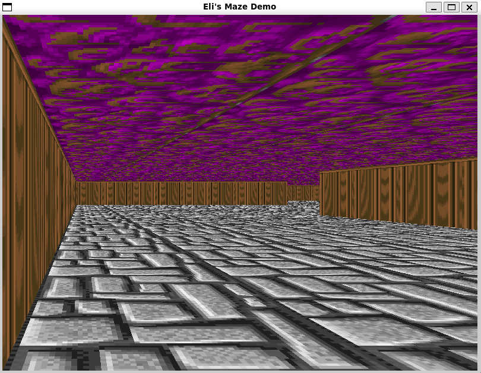

# Maze_Portfolio_Project_MVP-
Welcome to Geoffrey's and Eli's Maze Demo, a simple 3D raycasting maze game built using SDL2 and SDL2_image. This project demonstrates fundamental concepts in computer graphics and game development such as raycasting for 3D rendering, texture mapping, and basic user interactions.


## Table of Contents
- [Features](#features)
- [Requirements](#requirements)
- [Installation](#installation)
- [Usage](#usage)
- [Controls](#controls)
- [Code Overview](#code-overview)
  - [Main Components](#main-components)
  - [Functions](#functions)
- [Textures](#textures)
- [Screenshot](#screenshot)
- [Contributing](#contributing)
- [Acknowledgements](#acknowledgements)
- [Authors](#authors)

## Features
- 3D maze rendering using raycasting.
- Textured walls, floor, and ceiling.
- Basic player movement and rotation controls.

## Requirements
- SDL2
- SDL2_image

## Installation
1. **Install SDL2 and SDL2_image**:

   Follow the instructions on the SDL2 [installation page](https://wiki.libsdl.org/Installation) and the SDL2_image [installation page](https://www.libsdl.org/projects/SDL_image/).

2. **Clone the repository**:

   ```sh
   git clone https://github.com/ETG1/Maze_Portfolio_Project_MVP-.git

3. **Build the project**:

   ```sh
   g++ main.cpp -o maze_demo `sdl2-config --cflags --libs` -lSDL2_image

4. **Run**:

To run the demo, execute the compiled binary:

   ./maze_demo

## Code Overview
The project consists of a single C++ file (main.cpp) that handles initialization, game logic, and rendering. Below is an overview of the main components and functions.

### Main Components
- Constants and Global Variables: Define screen dimensions, texture sizes, map layout, player position, and direction vectors.
- Textures: Arrays to hold wall, floor, and ceiling textures.
- Map: A 2D vector representing the layout of the maze.

### Functions
- loadTextures: Loads texture images from files.
- drawFloorAndCeiling: Renders the floor and ceiling of the maze.
- drawWalls: Renders the walls of the maze using raycasting.
- moveForward: Moves the player forward in the direction they are facing.
- moveBackward: Moves the player backward.
- rotateLeft: Rotates the player to the left.
- rotateRight: Rotates the player to the right.
- main: The main function initializes SDL, loads textures, handles events, and runs the rendering loop.

## Textures
The textures used in the demo are essential for providing a visual representation of the walls, floor, and ceiling. The texture files should be placed in a pics directory in the same location as the executable. The textures used in this demo are:

- wall5.png
- wall6.png
- wall4.png



## Contributing
Contributions are welcome! If you have suggestions or improvements, please fork the repository and submit a pull request.

1. Fork the repository.
2. Create a new branch (`git checkout -b feature-branch`).
3. Commit your changes (`git commit -m 'Add amazing new feature'`).
4. Push to the branch (`git push origin feature-branch`).
5. Open a pull request.

## Acknowledgements
SDL2: Simple DirectMedia Layer
SDL2_image: SDL_image
This project is inspired by early 3D games and the raycasting techniques used in them. Special thanks to the SDL community and all the contributors who have made SDL a powerful tool for game development.
